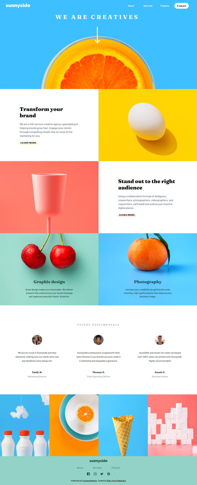
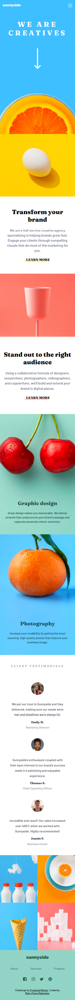
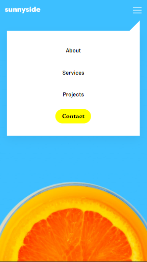

# Frontend Mentor - Sunnyside agency landing page solution

This is a solution to the [Sunnyside agency landing page challenge on Frontend Mentor](https://www.frontendmentor.io/challenges/sunnyside-agency-landing-page-7yVs3B6ef). Frontend Mentor challenges help you improve your coding skills by building realistic projects.

## Table of contents

-   [Overview](#overview)
    -   [The challenge](#the-challenge)
    -   [Screenshot](#screenshot)
    -   [Links](#links)
-   [My process](#my-process)
    -   [Built with](#built-with)
    -   [Useful resources](#useful-resources)
-   [Author](#author)

## Overview

### The challenge

Users should be able to:

-   View the optimal layout for the site depending on their device's screen size
-   See hover states for all interactive elements on the page

### Screenshot

### Links

-   Solution URL: [Github](https://github.com/rizky-pm/fm_sunnyside_landing-page)
-   Live Site URL: [Github Pages](https://your-live-site-url.com)

## My process

### Built with

-   Semantic HTML5 markup
-   CSS custom properties
-   Flexbox
-   Desktop-first workflow
-   [React](https://reactjs.org/) - JS library
-   [Styled Components](https://styled-components.com/) - For styles

### Useful resources

-   [How to use SVG in React? The styled components way](https://www.pinkdroids.com/blog/svg-react-styled-components/) - Helped me to re-fill SVG in react.

## Author

-   Frontend Mentor - [@rizky-pm](https://www.frontendmentor.io/profile/rizky-pm)
-   Twitter - [@\_rizkypm](https://twitter.com/_rizkypm)
